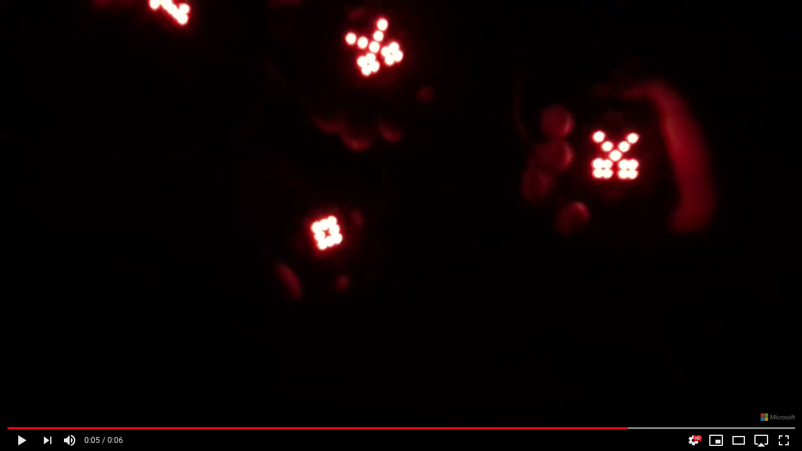
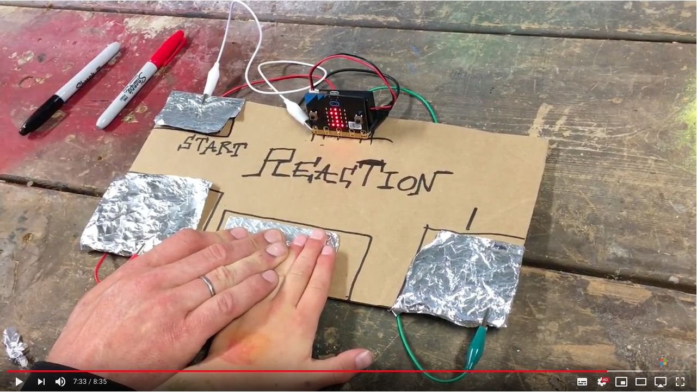
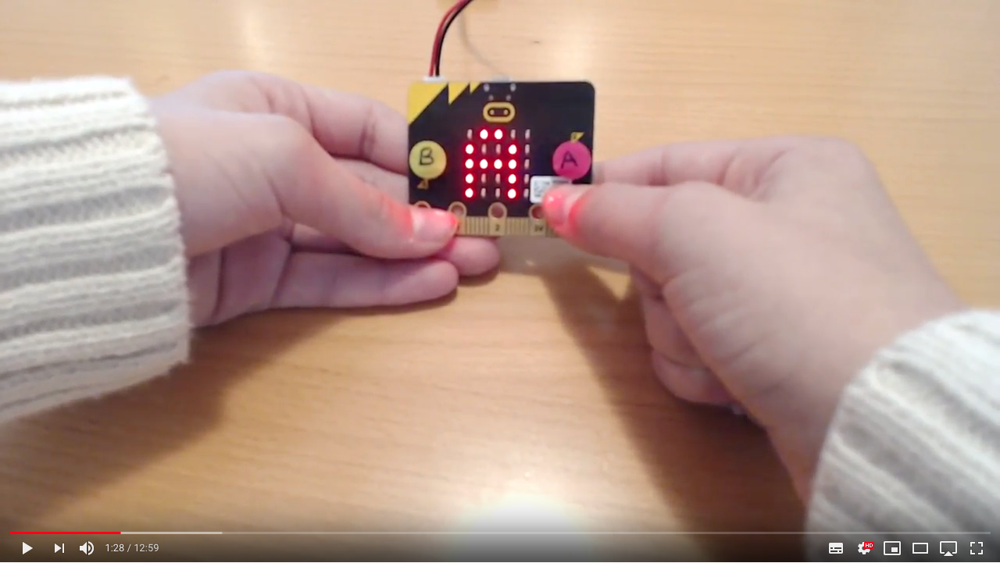
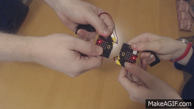

# Coole Dinge mit micro:bit programmieren
## (7. - 10. Klasse)

[Girls'Day micro:bit](https://clemenstyp.github.io/GirlsDay-MicroBit/)

In dem Workshop lernen wir, wie man kleine Programme schreibt und was man dann noch an coolen Dingen mit dem micro:bit anstellen kann. Diese Basics werden mit viel Praxis direkt in kreativen Projekten ausprobiert. Anschließend kann jede Teilnehmerin einen micro:bit mit nach Hause nehmen, um weiter daran zu üben und dann noch mehr kreative Dinge damit zu erstellen.

Wenn ihr noch Fragen habt könnt ihr mir auch gerne eine E-Mail schreiben: [clemens@putschli.de](mailto://clemens@putschli.de)

## Snake

Erste einfache Version:
[Snake](2018/microbit-Snake1.hex)
Code:
[Snake Code](https://makecode.microbit.org/_4qjfz48syYyz)

## A oder B Demo
[A oder B Code](https://makecode.microbit.org/_0uvRvP4WEVwh)

# Einführung in die Informatik

Diese Präsentation beruht auf der Präsentation von [stritti](https://github.com/stritti/girlsday-einfuehrung-informatik/blob/master/README.md).

**Deutsch:** Präsentation in HTML: **"Eine Einführung in die Informatik"**.

## [▶ Präsentation starten](https://clemenstyp.github.io/GirlsDay-MicroBit/einfuehrung/start.html)


> Diese Präsentation ist komplett in Deutsch gehalten. Sie ist auf Teeanager ab dem 10. Lebensjahr ausgerichtet und soll ihnen den Spaß an der Informatik zeigen. Um die Hürden möglichst niedrig zu halten, ist der Inhalt Deutsch.

 **English:** Presentation in HTML: **"An introduction to computer science"**.

 > This presentation is completely in German. It is aimed at tea managers from the age of 10 and should show them the fun of computer science. To keep the hurdles as low as possible, the content is in German.


## Links:
- Beispielprogramm: [https://pxt.microbit.org/90160-58930-77638-19883](https://pxt.microbit.org/90160-58930-77638-19883)
- online Editor: [https://makecode.microbit.org](https://makecode.microbit.org)
- BBC MicroBit Seite: [http://microbit.org/de/](http://microbit.org/de/)
- Einführung ins Programmieren: [https://calliope.cc/content/7-lehrer-informationen/booklet_calliope_mit_hinweis_auf_lizenzform_ohne_stockfoto_end.pdf](https://calliope.cc/content/7-lehrer-informationen/booklet_calliope_mit_hinweis_auf_lizenzform_ohne_stockfoto_end.pdf)
- Code Referenz: [https://pxt.microbit.org/reference](https://pxt.microbit.org/reference)


## Beispielanwendungen:
- Würfel: [https://pxt.microbit.org/02160-13677-24474-61646](https://pxt.microbit.org/02160-13677-24474-61646)
- Würfel vereinfacht: [https://pxt.microbit.org/38129-53595-79641-79509](https://pxt.microbit.org/38129-53595-79641-79509)
- Türschild: [https://pxt.microbit.org/98335-61183-64998-47776](https://pxt.microbit.org/98335-61183-64998-47776)

### Schnick-chnack-Schnuck MultiPlayer

[](https://www.youtube.com/watch?time_continue=5&v=8ztOmdZi5Pw)


[Rock Paper Scissors Teams](https://makecode.microbit.org/projects/rps-teams)

### Reaction Game

[](https://www.youtube.com/watch?v=DgJ-S0q0EMs)


### Magic Trick

[](https://www.youtube.com/watch?v=0Icwbcf3nXM)

### WarGames



Code: [WarGames.js](https://gist.github.com/gingemonster/89f4eb986609ef477559d762765a4ebd)

Wählt im Editor einfach JavaScript aus und fügt den Code ein.

Video: [MicroMonsters Episode 7](https://www.youtube.com/watch?v=l7LTg15KPgE)


### Sonstige Links (nicht so wichtig):
- MicroBit Playground: [https://microbit-playground.co.uk/](https://microbit-playground.co.uk/)
- Live Lessons: [http://www.bbc.co.uk/programmes/articles/2M3H2YpKLsw2W8fC2ycHYSR/welcome-to-the-micro-bit-live-lesson](http://www.bbc.co.uk/programmes/articles/2M3H2YpKLsw2W8fC2ycHYSR/welcome-to-the-micro-bit-live-lesson)
- Verschiedene MicroBit Ideen: [https://codeclubprojects.org/en-GB/microbit/](https://codeclubprojects.org/en-GB/microbit/)
- Reactions (ein 2 Personen Spiel): [https://codeclubprojects.org/en-GB/microbit/reaction/](https://codeclubprojects.org/en-GB/microbit/reaction/)
- Weitere Beispielanwendungen: [https://www.microbit.co.uk/blocks/lessons](https://www.microbit.co.uk/blocks/lessons)


Github.io: [https://clemenstyp.github.io/GirlsDay-MicroBit/](https://clemenstyp.github.io/GirlsDay-MicroBit/)

## HILFE
Stand: 27.04.2017

### Wie lade ich mein Programm herunter?
1. Bleibe auf dieser Seite bzw. rufe die Seite [https://github.com/clemenstyp/GirlsDay-MicroBit](https://github.com/clemenstyp/GirlsDay-MicroBit) auf.
2. Klicke oben rechts auf "Clone or download".
3. Klicke im Menü auf "Download ZIP". Es wird ein so genanntes "ZIP-Archiv" (ein Ordner, der komprimiert - also verkleinert - ist) heruntergeladen, der alle Ordner und Dateien enthält.
4. Dein Programm befindet sich in dem ZIP-Archiv genau in dem Ordner, unter dem du es im Workshop gespeichert hattest. Kopiere das Programm (eine Datei mit der Endung ".hex") aus dem ZIP-Archiv in einen Ordner deiner Wahl.

### Wie kann ich an meinem Programm bzw. Projekt weiterarbeiten?
1. Lade dir dein Programm herunter. Falls du nicht weißt, wie das geht, schau noch einmal unter der Frage oben nach. Merke dir den Ordner, in den du dein Programm gespeichert hast, gut.
2. Öffne den [Online Editor](https://pxt.microbit.org/?lang=de) und klicke oben links auf "Projekte".
3. Wähle im neuen Fenster "Datei importieren" aus und klicke auf "Datei auswählen".
4. Suche deine Datei mit der Endung ".hex", die du in Schritt 1 gespeichert hast und klicke auf "Los geht's". Dein Programm sollte nun geladen werden und du kannst weitere Änderungen durchführen. Das Programm kannst du dann wie im Workshop gezeigt wieder herunterladen und auf deinem micro:bit ausprobieren. Viel Spaß damit ;-)


## Grober Ablauf:
Der Workshop findet am **26.4.2018** von **9:45 - 11:45** und von **12:45 - 14:45** statt.

| Zeit         |      Beschreibung                 |  Bemerkung     |
|--------------|-----------------------------------|----------------|
| 9:45 (12:45) | Kurze Begrüßung mit Vorstellrunde | Jedes Mädchen soll sich vorstellen und erzählen ob es schon etwas am Computer gemacht hat |
| 10:00 (13:00) | Kurze Einführung in den Micro:Bit   | Das Gerät zeigen und die Funktionen kurz erklären (Tasten, LEDs, Batterie, PIN, USB, Reset, Kompass, Beschleunigungsmesser) |
| 10:15 (13:15) | Onlineeditor vorstellen |  Eine kurze Einführung in den Onlineeditor geben. Wie installiere ich ein Programm auf den Micro:Bit, wie lasse ich den Code im Browser laufen. |
|10:30 (13:40) | Erste Versuche mit dem Online Editor | Jeder soll das  [Beispielprojekt](https://pxt.microbit.org/90160-58930-77638-19883) im Browser öffnen und sich anschauen. Verstehen die Kinder das Projekt? Dann sollen sie mal auf den Play Button drücken. Was passiert dann? Kann wer das Programm erklären? Ansonsten erkläre ich das Programm|
|10:45 (13:45) | Das Programm anpassen | Jetzt verändern wir mal das Programm. Wie könnte man das Programm verbessern? Was kann man noch einbauen?|
|11:15 (14:15) | Brainstorming nach neuen Ideen | Was könnte man noch mit dem Micro:Bit alles machen? Ich zeige auch ein paar Onlineseiten wo man weitere Hilfe bekommt. |
|11:40 (14:40) | Reflexion | Kurze Reflexion wie es den Teilnehmerinnen gefallen hat. Entweder wird ein kurzes Blitzlicht gemacht, oder es wird eine Micro:Bit Reflexion App genutzt (Bei der App kann man mit den Tasten des Micro:Bits zwischen Super, Mittel und Kacke auswählen). |

<!--- ### Markdown Help

Markdown is a lightweight and easy-to-use syntax for styling your writing. It includes conventions for

```markdown
Syntax highlighted code block

# Header 1
## Header 2
### Header 3

- Bulleted
- List

1. Numbered
2. List

**Bold** and _Italic_ and `Code` text

[Link](url) and 
```

For more details see [GitHub Flavored Markdown](https://guides.github.com/features/mastering-markdown/).-->
